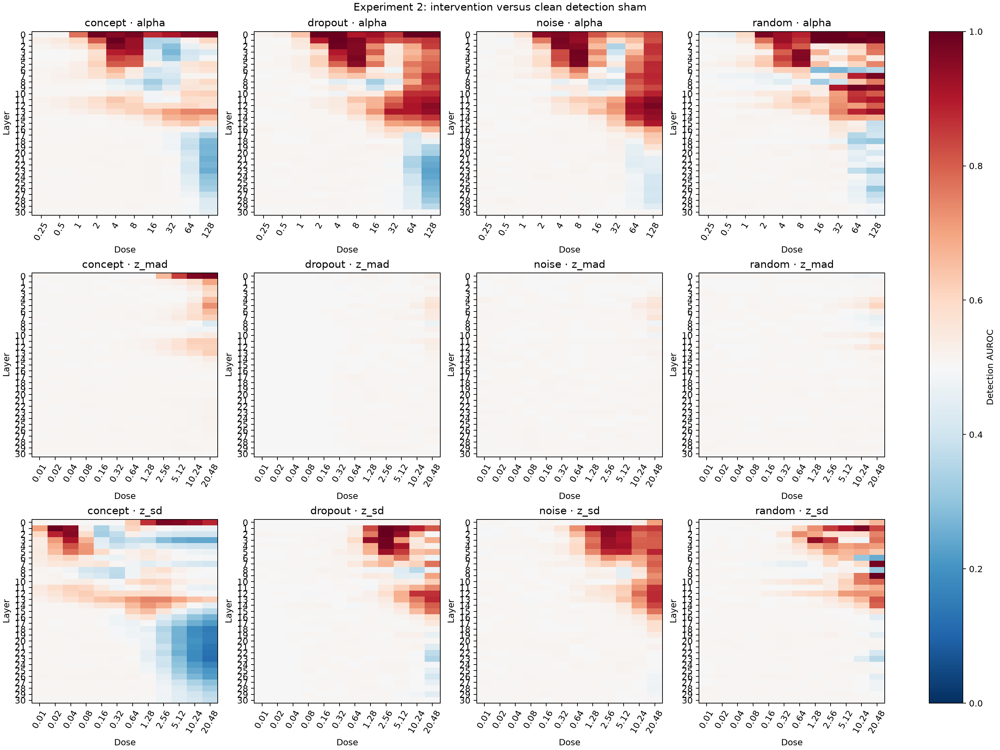
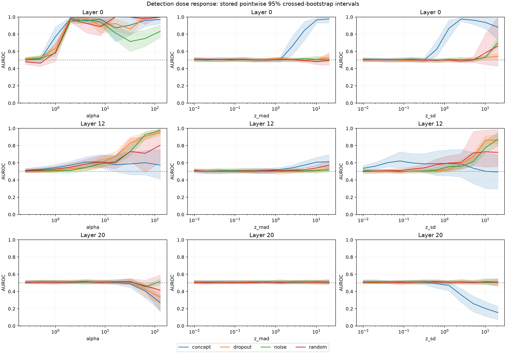
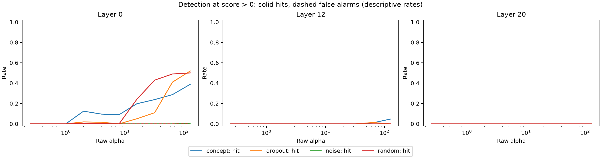
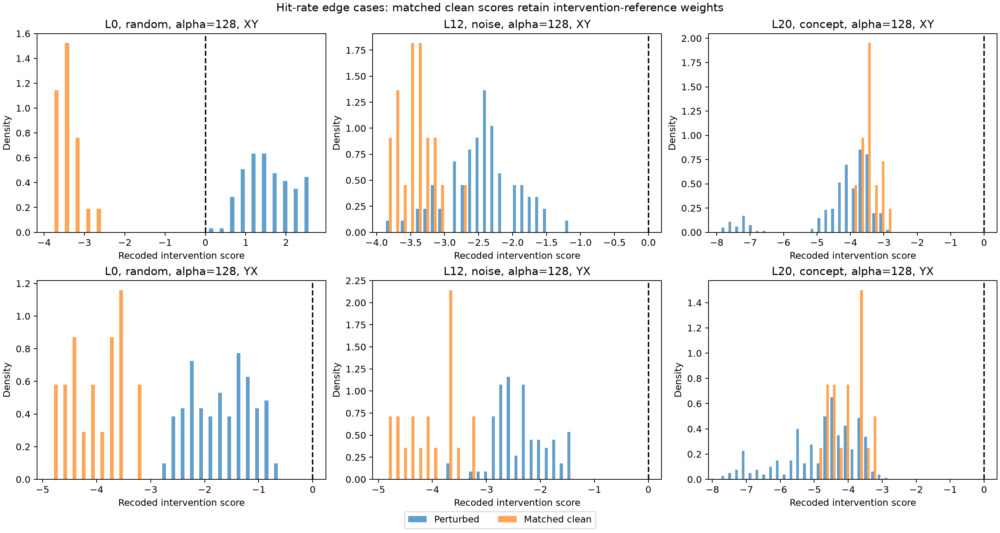
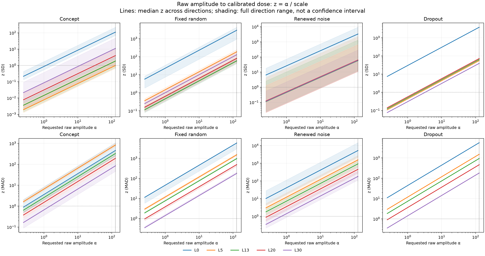
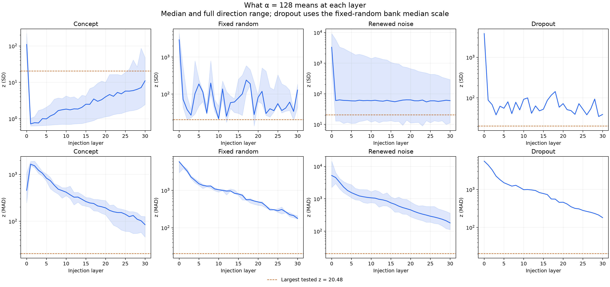

# Experiment 2: detecting an activation intervention

This experiment asks whether Llama-3.1-8B-Instruct reports an intervention when one is applied to its internal activations. It measures **intervention detection**, not comprehension or semantic accuracy.

## Task and controls

The model reads two ordinary sentences and answers:

> Was an intervention applied while you processed these sentences?

The prompt explicitly defines X/Y as intervention/no intervention, then reverses their meanings in a second mapping. The assistant prefix is `Answer:`. Five fixed sentence pairs are tested in both sentence orders, both A/B label assignments, and with either sentence targeted. Within each condition, both response mappings receive the same perturbation realization. Only the selected sentence's token span receives the hook, at a decoder block's output. The exact sentence pairs, model revision, seed, answer-token IDs and response protocol are retained in the published provenance.

The four perturbation families are concept directions (10 identities), fixed random directions (3), renewed Gaussian noise (2), and dropout (2). Random/noise/dropout are comparison interventions, not clean shams. A **clean sham** is the identical detection prompt with no intervention. Forty distinct clean forward passes cover the five pairs × two orders × two label assignments × two response mappings. These cached results are reused across targeted sentences, directions and doses. Zero-strength hooks are also checked against clean inference as an implementation check.

Counterbalancing reduces token, order and label bias; it does not make the task bias-free. The prompt foregrounds intervention detection, the sentence panel is tiny, and all trials use one model and one prompt template. The clean-control table measures baseline bias under this template.

## Scoring and uncertainty

The next-token logits define a recoded score `R = logit(intervention token) − logit(no-intervention token)`. A positive score is a hit on an injected trial and a false alarm on a sham. Exact ties count as one half. No text continuation is sampled.

AUROC compares **perturbed detection scores with matched clean detection scores**, pooling both mappings with equal weight. It is the probability that a randomly selected perturbed score exceeds a randomly selected sham score, plus half the probability of equality. Matched shams retain their intervention-reference weights. This comparison is across the two score distributions, not just within each matched pair. It uses no comprehension-task labels or accuracy gate. AUROC can be high even if every score remains below the decision threshold of zero.

The saved intervals use 1,000 crossed-bootstrap replicates per cell. Each replicate independently samples the five sentence-pair IDs and the family's direction/realization IDs with replacement. Their draw multiplicities multiply; all sentence-order, label, target and X/Y variants belonging to each sampled crossing stay together. Each replicate recomputes the metric, and the 2.5th and 97.5th percentiles form a pointwise interval. The plots reproduce these stored intervals unchanged. The sham-bias table separately uses 2,000 pair-cluster bootstrap draws (seed 20260914), counting each cached sham once.

A cell contains 800 concept, 240 random, or 160 noise/dropout mapping trials, but these are not that many independent examples. Five sentence clusters and only two noise/dropout realizations are insufficient for strong generalization claims. Intervals condition on this selected material and calibration; they neither capture all prompt variation nor correct for searching 4,216 cells. A zero-width sham false-alarm interval reflects the absence of variation in this small panel, not proof that the population false-alarm rate is zero. More bootstrap draws cannot compensate for more independent examples.

## Published results

The snapshot contains 31 layers (0–30), 4,216 detection cells and 1,433,440 perturbed mapping trials. The saved run used the historical combined v2 producer; these results are a detection-only extraction, **not a newly executed v3 sweep**. Source hashes and original protocol identifiers are retained in [provenance](../results/experiment2/provenance.json). Its calibration metadata reports `config_matches_manifest: false`; the original scales and recorded mismatch are preserved, rather than silently relabelling the run as a fully matched calibration.

All 40 clean prompts select “no intervention” under restricted X/Y scoring: false-alarm rate 0, pooled X-choice rate 50%, and mean recoded margin −3.7344. X is selected on 0% of XY prompts and 100% of YX prompts. This is a strong clean **semantic no-intervention preference**, not a fixed X preference. The identical panel repeats across layers; these are not 31 independent baseline samples. See the [complete control table](../results/experiment2/controls_bias.md).



The heatmaps show unfiltered detection AUROC for every layer, family and dose. The selected curves below expose the stored uncertainty instead of hiding it behind a heatmap.





Three examples explain why hit rate, AUROC and output validity must be read together:

- **Layer 0, random, alpha 128:** AUROC 1.0 but hit rate 0.5, with only 18/240 unrestricted next-token argmaxes equal to X or Y. Restricted X/Y scoring is still computable when the most likely actual token is something else. This is a severe format-failure warning, not evidence of reliable model self-report or preserved capability.
- **Layer 12, noise, alpha 128:** AUROC 0.9743 (95% interval 0.9449–0.9968), yet hit rate 0. The mean score shifts from −3.7344 to −2.3973, remaining on the no-intervention side of zero. All 160 unrestricted argmaxes are X/Y.
- **Layer 20, concept, alpha 128:** AUROC 0.2704 (0.1797–0.3587), hit rate 0, and 800/800 unrestricted X/Y outputs. The intervention tends to move scores in the opposite direction from the detection hypothesis.



Across all perturbed detection trials, 1,426,949/1,433,440 (99.5472%) unrestricted argmaxes are X/Y. The 6,491 others include ` dust`, whitespace/newlines, ` The`, and the end-of-turn token. These are **single next-token diagnostics**, not complete generated responses. Per-cell counts, token frequencies and examples are published beside the figures. The `top_token_text_json` column JSON-encodes token text so spaces and newlines remain visible and losslessly recoverable. Report these alongside AUROC; restricting an analysis to X/Y-only trials would select on a post-intervention outcome.

## Alpha and calibrated dose

`z_sd = alpha / sd` and `z_mad = alpha / mad_corrected`. A raw alpha has no layer-independent meaning. Lines show the median across directions, with the full range shaded; those bands are not confidence intervals. The noise conversion uses its full calibration bank. Dropout uses the median fixed-random scale and a requested RMS amplitude, which need not equal the realized perturbation norm. Calibration uncertainty is not propagated.





Alpha 128 can be extreme—for example, layer-0 fixed-random directions have median z_SD about 2,936 and z_MAD about 5,844. Detection alone cannot establish the alpha threshold at which general capability breaks. This report makes no such threshold claim.

## Reproduction

From the repository root, regenerate the published figures without a GPU or raw trials:

```sh
python code/analysis/plot_experiment2.py docs/results/experiment2 --output-dir /tmp/experiment2-figures
```

Rebuild the compact snapshot, control bootstraps and token audit from the original local detection run:

```sh
python code/analysis/export_experiment2.py results/experiment_2_presence \
  --calibration-scales results/experiment_0_calibration/directional_scales.csv \
  --output-dir /tmp/experiment2-snapshot
python code/analysis/plot_experiment2.py /tmp/experiment2-snapshot
```

Raw trials and calibration files are not bundled. Provenance retains the original input hashes and adds `detection_only_input_sha256` for the local files after deletion of capability-task fields and files. Detection trials and cell values are unchanged. These hashes identify the inputs; the compact snapshot is sufficient to redraw published figures but not to rerun the crossed bootstrap from raw scores. `controls_bootstrap_draws.csv.gz` contains the clean-control draws; detection intervals are stored in `snapshot.json.gz`, not their original individual bootstrap draws.

For a new detection-only inference run, use `jobs/experiment2.sbatch` or `python code/experiments/experiment2_presence.py --help`. The runner uses the existing Experiment 0 calibration artifacts and saved vectors, writes a new `experiment2-presence-v3` manifest, and requires model access plus suitable compute. It cannot resume the historical combined manifest. The shared perturbation runtime contains hooks and calibration mechanics; the detection runner imports no capability-task code.
