# Multi-Steering Experiments Report

**Model:** `meta-llama/Llama-3.1-8B-Instruct` · **Dose range:** `alpha` (= the plan's `z`, unstandardized) swept over `1–7` in an initial broad pass, then narrowed to `2–5` with added controls in a follow-up · **Total trials:** ~13,000 across two rounds

## What this report is about

Can Llama-3.1-8B-Instruct introspect on **multiple simultaneous concept injections** — how many were made, what they were, and their relative depth in the network? This covers Experience 9 (counting), 10 (identification), and 11 (layer-depth ordering, plus its modulators) of `plan_of_research.md`.

**If you read nothing else, read this:** the model shows no reliable evidence of tracking the count, identity, or relative depth of simultaneous injections. Raw accuracy looked informative at first, but every experiment turned out to be dominated by a strong, content-independent default-answer bias — the model answers "1" for counting and "A" for ordering almost regardless of the true answer. We built two additional controls specifically to check whether a real signal was hiding underneath that bias (a bias-adjusted logit contrast, and a paired no-injection baseline). Both controls make the null conclusion *more* confident, not less: counting shows a strong, statistically overwhelming preference for "1" even in the raw logits, and ordering's one promising-looking result evaporated once tested against a matched sham condition. The rest of this report walks through how we got to that conclusion, experiment by experiment.

## Contents

1. [Methodology](#methodology)
2. [Experience 9 — Counting](#experience-9--counting)
3. [Experience 10 — Identification](#experience-10--identification)
4. [Experience 11 — Layer-Depth Ordering](#experience-11--layer-depth-ordering)
5. [Experience 11 Modulators (E4/E5/E6)](#experience-11-modulators-e4e5e6)
6. [Cross-Cutting Technical Notes](#cross-cutting-technical-notes)
7. [Summary and Recommendations](#summary-and-recommendations)
8. [Appendix A — Alpha Dependence (Full Sweep)](#appendix-a--alpha-dependence-full-sweep)
9. [Appendix B — Bias-Controlled Re-run Details](#appendix-b--bias-controlled-re-run-details)

---

## Methodology

- **Injection:** unit-normalized concept steering vectors added to the residual stream at a chosen layer, sustained through generation (`code/utils/multi_inject.py`). `alpha` plays the role of the plan's standardized dose `z` directly — no natural-scale (`s(ℓ,v)`) calibration was performed for this pass (a deliberate scope decision; see `multisteering_implementation_plan.md`).
- **Two experimental rounds.** Round 1 swept `alpha`/`z_total` over `[1, 2, 3, 4, 5, 6, 7]` across all experiments, chosen after a smoke test showed this range keeps response coherence near 100% (vs. heavy degeneration at the previous default `alpha=8`). Round 1 revealed the response-position bias described below. Round 2 re-ran Exp 9 and Exp 11 with two purpose-built bias controls (described in their own sections) over a narrower `alpha 2–5` range with more trials per cell, to get more statistical power where Round 1's effects looked strongest.
- **Layer pool:** all 32 transformer blocks (0–31). **Concept pool:** 10 concepts (5 simple: `Dust, Satellites, Trumpets, Origami, Illusions`; 5 complex: `fibonacci_numbers, recursion, betrayal, appreciation, shutdown`).
- **Coherence filtering:** `is_coherent()` flags degenerate/repetitive or non-answers; the threshold was tuned per prompt format (`min_length=1` for single-token forced formats — count, forced-choice, A/B letter — vs. the default 5 for open-ended free response), after an early run showed valid one-character answers like `"1"` or `"A"` were being wrongly excluded (see [Cross-Cutting Technical Notes](#cross-cutting-technical-notes)).
- **Grading:** free-response identification is graded by cosine similarity between the response and canonical concept descriptions (`all-MiniLM-L6-v2`, forced to run on CPU — see Technical Notes).

| Experiment | Script | Conditions | Round 1 trials | Round 2 trials |
|---|---|---|---|---|
| Exp 9 — counting | `multi_detection.py` | `individual` + `budget` dosing regimes × `{real, random}` × k∈{0..4} | 5,600 | 2,880 |
| Exp 10 — identification | `multi_identification.py` | `single_concept`, `two_concepts`, `concept_plus_random`, `sham` | 1,680 | — |
| Exp 11 — ordering | `layer_ordering.py` | shallow/deep × A/B label assignment | 560 | 480 (doubled per cell: injected + matched sham) |
| Exp 11 modulators | `modulators.py` | E4 (distance), E5 (dose ratio), E6 (concept similarity) | 2,940 | — |

---

## Experience 9 — Counting

**Task:** `k ∈ {0,1,2,3,4}` concepts injected at distinct layers; the model must answer with exactly one digit, 0–4. `k=0` is the true sham.

### Round 1: the model's answer doesn't track `k` — it defaults to "1"

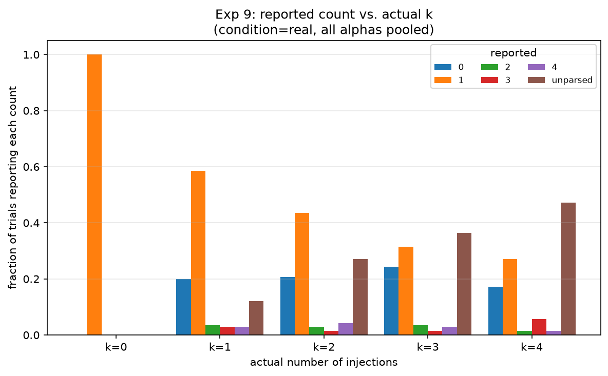

At the true sham (`k=0`), the model answered **"1" in 100% of trials**, in both dosing regimes and across every alpha — never once answering "0". The response distribution stays dominated by "0"/"1" regardless of the true count; "2", "3", and "4" are essentially never reported.

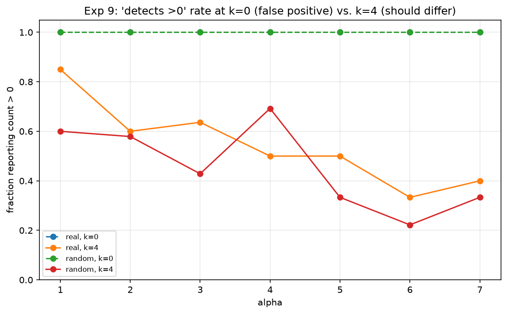

Because the false-positive rate is already saturated at 100% at `k=0`, there's no headroom left to observe a real increase in "detects something" rate as `k` grows.

### The question this raises: is there a hidden signal underneath the bias?

A model that "knows" the true count internally but defaults to saying "1" for output-level reasons would still be expected to show *some* extra evidence for the true digit in its raw logits, even if it doesn't act on that evidence in its final answer. To test this, we added a **digit-level logit contrast**: `logit(true k's digit) − logit("1")` at the first response token, extracted directly from the same generation call (no extra forward pass needed). This is trivially 0 when `k=1` and is available for every trial, whether or not the decoded text was parseable.

### Round 2: no — the bias goes all the way down to the logits

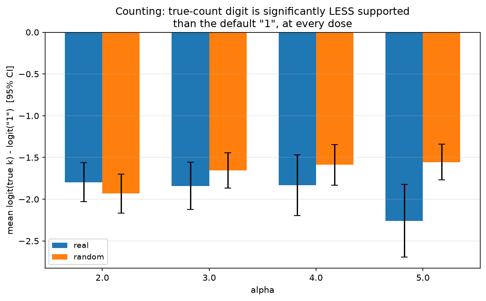

The result is unambiguous and goes in the opposite direction from "hidden signal": `logit(true k) − logit("1")` is **strongly and consistently negative** at every dose tested (2–5), in both conditions (real injection vs. random-direction control) and both dosing regimes:

| Dataset | Mean contrast | n | t | p |
|---|---|---|---|---|
| individual regime, pooled | −1.81 | 1,280 | −34.7 | 1.8×10⁻¹⁸⁶ |
| budget regime, per cell | −1.55 to −2.38 | 160/cell | −10 to −16 | as low as 7×10⁻³⁶ |

**Conclusion:** this is a clean, strongly-powered null. The "1" bias isn't a decoding-time shortcut masking real information underneath — the raw logits themselves robustly and overwhelmingly prefer "1" over the true count, regardless of how many concepts were actually injected.

---

## Experience 10 — Identification

**Task:** four conditions varying what's actually injected, always under the same ambiguous "two slots may contain identifiable content" framing. Each condition is scored in forced-choice (pick two labels from a candidate list including `NONE`) and free response.

| Condition | n_real | n_random | Correct forced-choice answer |
|---|---|---|---|
| `single_concept` | 1 | 0 | one concept letter + `NONE` |
| `two_concepts` | 2 | 0 | two concept letters |
| `concept_plus_random` | 1 | 1 | one concept letter + `NONE` |
| `sham` | 0 | 0 | `NONE`, `NONE` |

### No reliable identification signal in either format

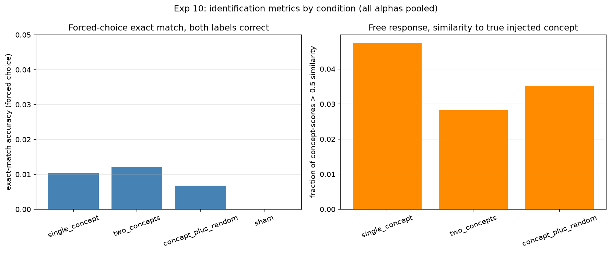

- **Forced-choice exact match** (both slots correct): 0.0–1.2% in every condition — essentially never happens, including `single_concept` where only one slot needs a specific concept letter.
- **Free response:** similarity to the truly-injected concept clears the 0.5 threshold only 2.8–4.7% of the time (`sham` has no real concept to score against, so it isn't shown here).

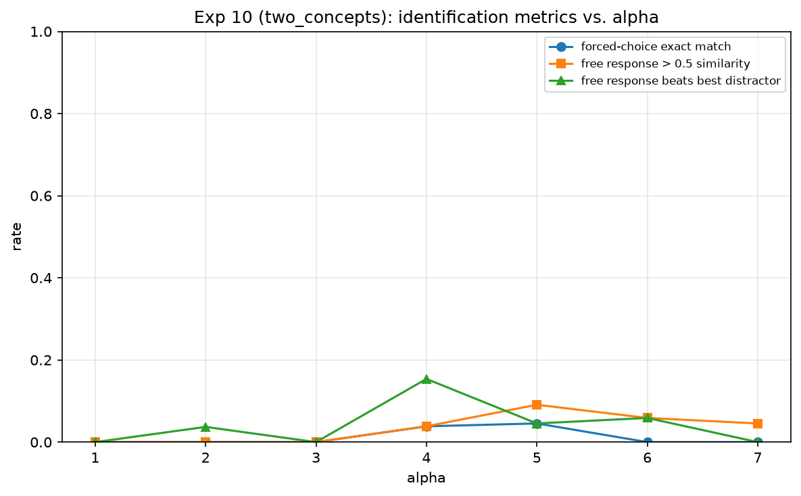

There's a mild upward trend with alpha for `two_concepts` (exact match rises from 0% at alpha 1–3 to ~4.5% by alpha 5), but sample sizes shrink at high alpha as coherence drops, so this is suggestive at best.

**One clean result:** `sham`'s NONE-slot false-identification rate — does the model ever falsely name a specific concept when nothing identifiable was injected — is exactly **0%**.

Identification hasn't yet been re-tested with a bias-adjusted logit measure the way counting and ordering were (see [Appendix B](#appendix-b--bias-controlled-re-run-details) for why that's harder here), so unlike those two experiments, this conclusion rests on the discrete accuracy numbers alone. Given how decisively those already sit at floor, that's a reasonable place to stop for now.

---

## Experience 11 — Layer-Depth Ordering

**Task:** two concepts injected at two distinct layers; the model is asked which was injected at the shallower layer, presented as `A) {concept}` / `B) {concept}`, answered with a single letter. Which physical layer gets labeled A vs. B is randomized independently of which is actually shallower — the plan's built-in bias control.

### Round 1: a strong "always answer A" bias, not layer-depth tracking

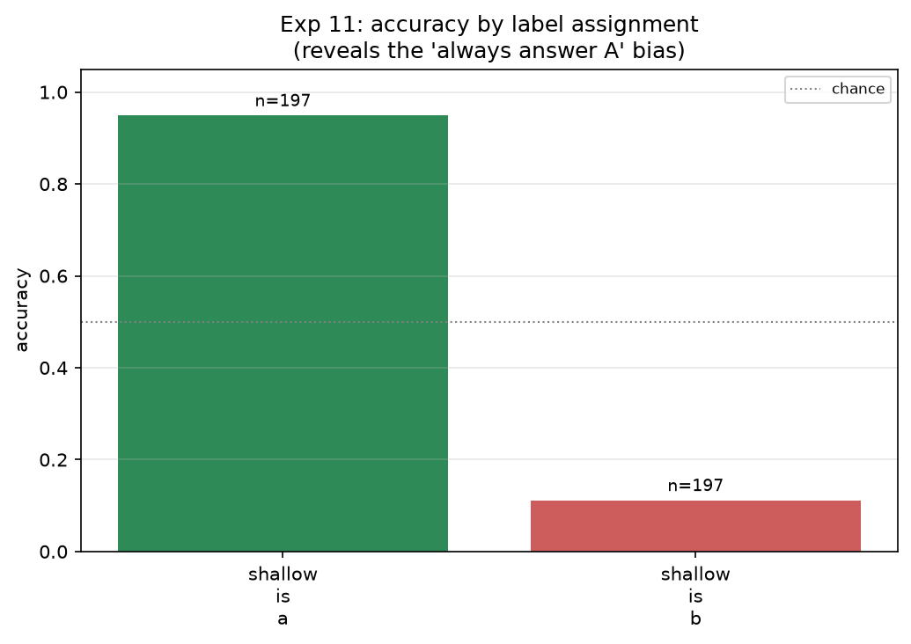

- When the shallow (correct) concept happened to be labeled A: **94.9%** accuracy.
- When it was labeled B: **11.2%** accuracy.

These are mirror images of the same thing: the model answers "A" ~90%+ of the time regardless of which concept was actually shallower. Pooled, overall accuracy is **53.0%**, not distinguishable from chance (binomial p=0.25).

### First control: a bias-adjusted logit contrast

Rather than only the discrete A/B choice, we extract the model's raw logits for "A" and "B" at the first response token and compute `logit(correct letter) − logit(incorrect letter)`, sign-flipped per trial so a positive value always means evidence toward the correct answer, canceling the fixed A-preference.

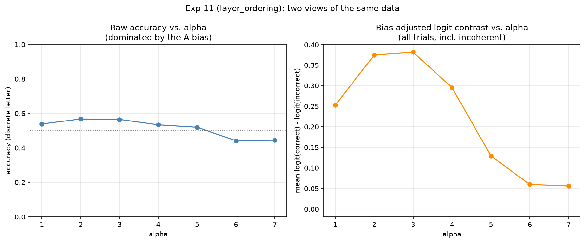

This told a more interesting story than flat, near-chance accuracy: the mean adjusted contrast was **positive at every alpha**, peaking around alpha 2–3 (+0.38) and fading toward zero by alpha 6–7 — suggestive of a small real effect concentrated at moderate dose, though not significant on its own (t=1.28, p=0.20, n=560).

### Second control: is that hint real, or just another baseline preference?

The adjusted contrast above only controls for a *symmetric* A-vs-B letter preference. It doesn't rule out a subtler possibility: that the model has some baseline preference tied to *this specific prompt* (which two concepts are named, which one is called A) that has nothing to do with any injection at all. To test this directly, we re-ran Exp 11 with a **paired sham baseline** (the plan's own `L_adjusted` technique from §5.7, applied here): every injected trial is matched with a second generation on the *identical* prompt — same concept names, same A/B labels — but **zero injection**. `logit_contrast_double_adjusted = injected contrast − sham contrast` isolates whatever the injection itself contributes, above and beyond however this specific prompt already leans with no injection at all. This doubles the generations per cell, so we re-ran at the narrower alpha 2–5 range with more trials for power.

### Round 2: the hint doesn't survive — it was the baseline all along

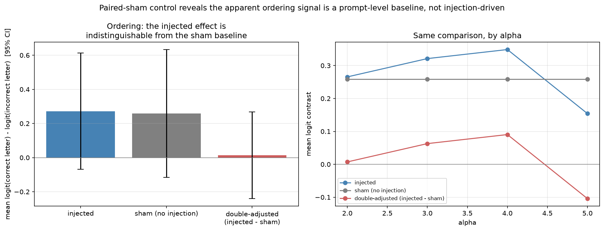

| | mean contrast | n | p |
|---|---|---|---|
| injected | +0.272 | 480 | 0.12 |
| **sham (no injection)** | **+0.258** | 480 | 0.18 |
| **double-adjusted (injected − sham)** | **+0.014** | 480 | **0.91** |

The sham condition — same prompt, zero injection — produces almost the *same* logit contrast as the actual injected trials. Once that baseline is subtracted out, the injection's own contribution is +0.014: not distinguishable from zero at any dose in 2–5 (right panel — the sham line, gray, sits flat regardless of dose, as it should since nothing is injected; the double-adjusted line, red, hovers around zero and even dips slightly negative at alpha 5).

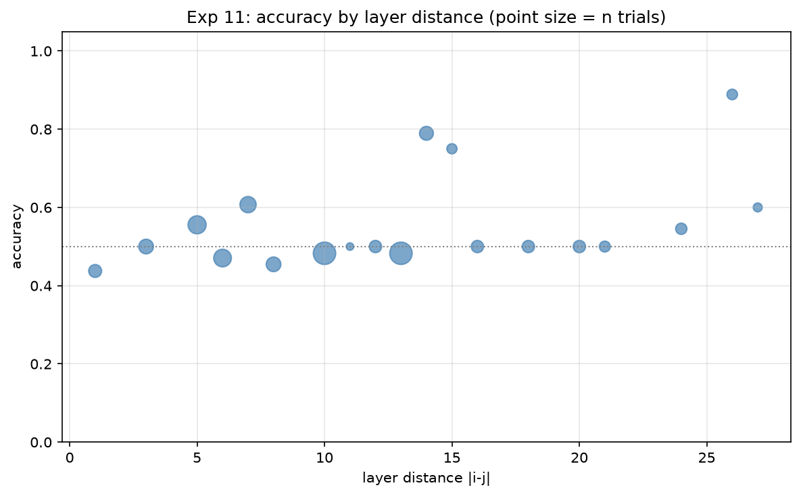

(No clean trend in raw accuracy vs. layer distance either — noisy, small per-cell samples.)

**Conclusion:** what looked in Round 1 like a small, real, bias-corrected signal for relative depth was actually the model's baseline preference for that specific prompt, present with or without any injection. Once properly isolated, there's no detectable injection-specific effect in the tested range.

---

## Experience 11 Modulators (E4/E5/E6)

Same ordering task, same A/B lettered format, swept against three additional variables: layer distance/placement (E4), relative dose `z_A/z_B` (E5), and injected concept-pair cosine similarity (E6). Each also sweeps alpha 1–7. **These have not been re-tested with the paired-sham control** — read the one significant-looking result below with that in mind.

### E4 — layer distance: a result that now needs re-checking

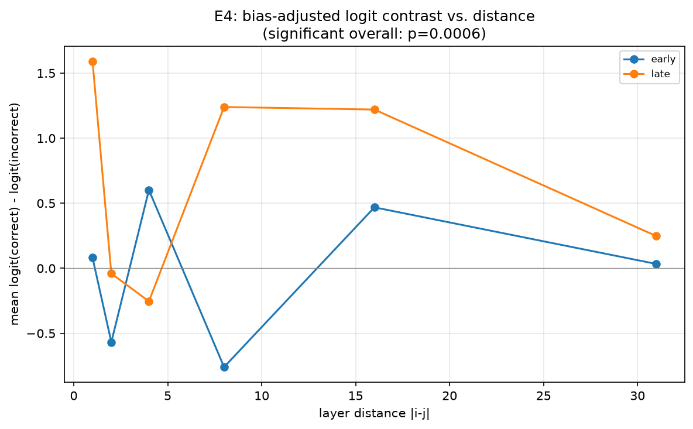

With 1,680 trials (3× `layer_ordering`'s own Round 1 sample), the mean adjusted logit contrast was **+0.322, reaching significance** (t=3.43, p=0.0006) — same sign and similar magnitude to `layer_ordering`'s own (non-significant) Round 1 result. At the time, this looked like the most credible evidence of a real signal in this whole batch. **Given that `layer_ordering`'s nearly identical-looking effect was fully explained away by a matched sham baseline, E4's result should now be treated as unconfirmed, not established** — the same paired-sham design used for `layer_ordering.py` would need to be ported to `modulators.py`'s `run_e4_distance_sweep` before trusting it.

### E5 & E6 — a different trap: large negative averages that are the *same* bias, not a new effect

Taken at face value, E5 (dose ratio) and E6 (similarity) both look strongly *negative* overall (−0.574, p=3.5×10⁻⁵ and −0.874, p=2.9×10⁻⁷ respectively) — but splitting by which letter was actually correct shows this is the *exact same* A-bias as everywhere else, just unevenly sampled:

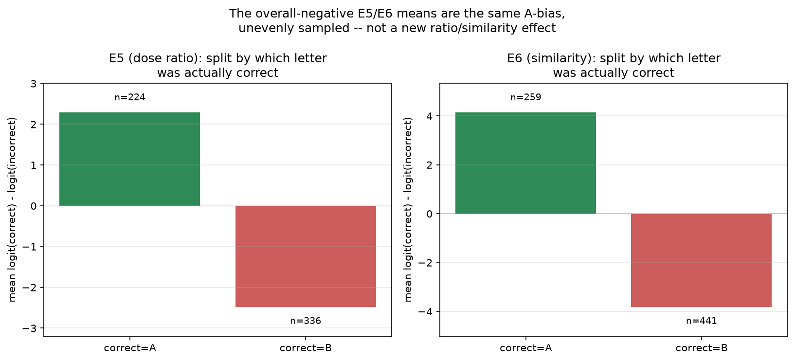

Both sweeps show strongly positive contrast when A happens to be correct, strongly negative when B happens to be correct — the overall negative average is simply because each sweep's random draw happened to land more B-correct trials than A-correct (E5: 336 vs. 224; E6: 441 vs. 259). Not a real ratio- or similarity-dependent effect.

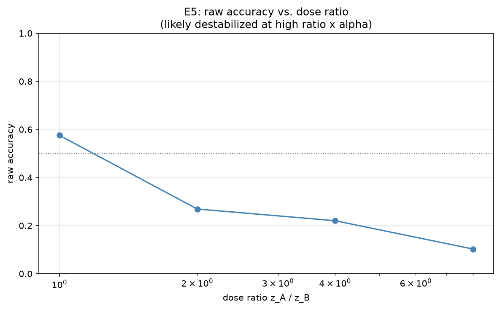

E5's raw accuracy does drop sharply as the dose ratio grows, but this is confounded with dose magnitude: at ratio=8 and base alpha up to 7, the boosted slot's effective dose reaches **56** — nearly 8× outside the alpha range validated for coherent output. Re-run with `--alpha_ratios`/`--alphas` capped before trusting this.

---

## Cross-Cutting Technical Notes

Two real bugs were found and fixed mid-run:

1. **`is_coherent()` length threshold.** Its default `min_length=5` was tuned for the old open-ended calibration prompt. Applied unchanged to the new strict single-token formats (count, forced-choice, A/B letter), it wrongly marked valid one-character answers like `"1"` or `"A"` as incoherent — silently corrupting every downstream accuracy table. Fixed by passing `min_length=1` at the relevant call sites (`multi_detection.py`, `layer_ordering.py`, `modulators.py`, and `multi_identification.py`'s forced-choice branch; its free-response branch correctly kept the stricter default). All data in this report reflects the fix.
2. **GPU contention crash in `embedding_judge.py`.** The free-response grading model (`SentenceTransformer`) was loading onto the same GPU as the 8B injection model, and twice crashed mid-sweep with `CUDA error: device(s) busy or unavailable` when multiple jobs shared a node. Fixed by forcing the grading model onto CPU (`device="cpu"`) — it's tiny (~80MB) and this eliminates the contention path entirely rather than relying on retries.

A third, non-code issue: `multi_identification.py --run_all_conditions` chains all four conditions in one process; at real full-scale `--num_trials`, each condition takes ~2.5–4h depending on cluster contention, so the combined run doesn't fit an 8h walltime. It was split into four independent per-condition jobs that run in parallel instead. Similarly, the Round 2 `multi_detection` re-run initially timed out at 4h under heavy cluster contention (no output saved, since it only writes at the very end) and needed a longer walltime on resubmission — worth budgeting generously for these jobs regardless of how small the trial count looks on paper.

---

## Summary and Recommendations

- **The dominant finding across Exp 9 and Exp 11 is response-position/default-answer bias, not injection tracking**, and it is *robust*: it survives coherence filtering, bias-adjusted logit contrasts, and — for ordering — a matched no-injection sham control.
- **Exp 9 (counting) is a confirmed, strongly-powered null.** The model's raw logits, not just its decoded answers, prefer "1" over the true count at every dose tested.
- **Exp 11 (ordering)'s one promising result did not survive its own control.** The paired-sham baseline showed the apparent signal was the prompt's own preference, not the injection's.
- **Exp 10 (identification) shows no reliable signal in either response format**, at the group level, in any of the four conditions.
- **E4's significant result (modulators) is now unconfirmed**, not refuted — it needs the same sham test that debunked its close cousin in `layer_ordering`.
- **Recommended next steps, in priority order:**
  1. Port the paired-sham design to `modulators.py`'s `run_e4_distance_sweep` — this is the one remaining claim in the whole batch that hasn't been tested against a matched no-injection baseline, and it's the closest thing to a positive result on record.
  2. Add per-concept precision/recall to `identification_accuracy.py` (plan §15.6), since exact-match likely understates partial correctness.
  3. Re-run E5 with `--alphas`/`--alpha_ratios` capped so the boosted slot never exceeds the validated alpha 1–7 coherence range.
  4. Given the strength and consistency of the bias, a dedicated follow-up varying the answer-token identity itself (different letter pairs, numeric vs. letter formats) could help establish whether it's a generic "prefer the first/simplest option" tendency or something more specific to these tokens.
  5. If pursuing E4/E5/E6/identification further, reconsider the alpha range: 2–5 was chosen because Round 1 suggested the (since-debunked) ordering effect peaked there — that's no longer a principled reason to search there specifically for a different experiment.

---

## Appendix A — Alpha Dependence (Full Sweep)

*This appendix reflects the original, broad alpha 1–7 sweep (Round 1), before the bias controls in the main sections above were introduced. It's kept for the fuller per-dose picture across all four experiments, including Exp 10 and the modulators, which weren't part of the narrower Round 2 re-run.*

### A.1 — Experience 9 (counting)

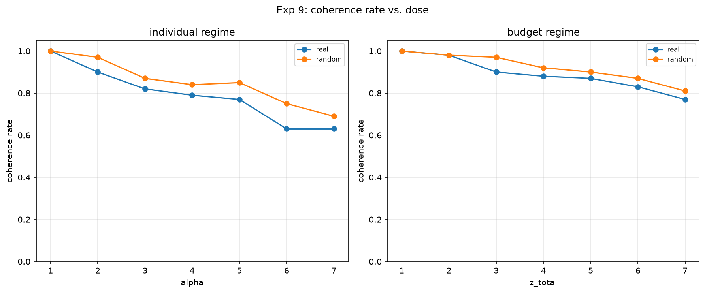

Coherence degrades smoothly and predictably with dose in both regimes — from 100% at the lowest dose down to 63–77% (`individual`) / 77–81% (`budget`) at the highest, `random`-condition trials staying a few points more coherent than `real` throughout.

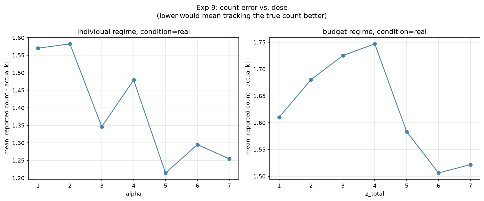

Mean `|reported − actual|` count error doesn't show the model getting *closer* to the true count as dose increases — consistent with the "defaults to 1" finding confirmed in the main section above.

### A.2 — Experience 10 (identification)

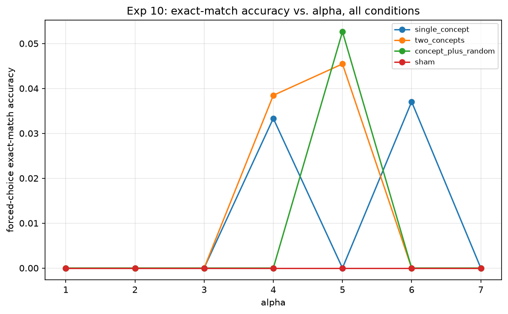

Exact-match accuracy stays at or near zero across the entire alpha range, for every condition — occasional spikes reflect a single lucky trial in a shrinking sample, not a real trend.

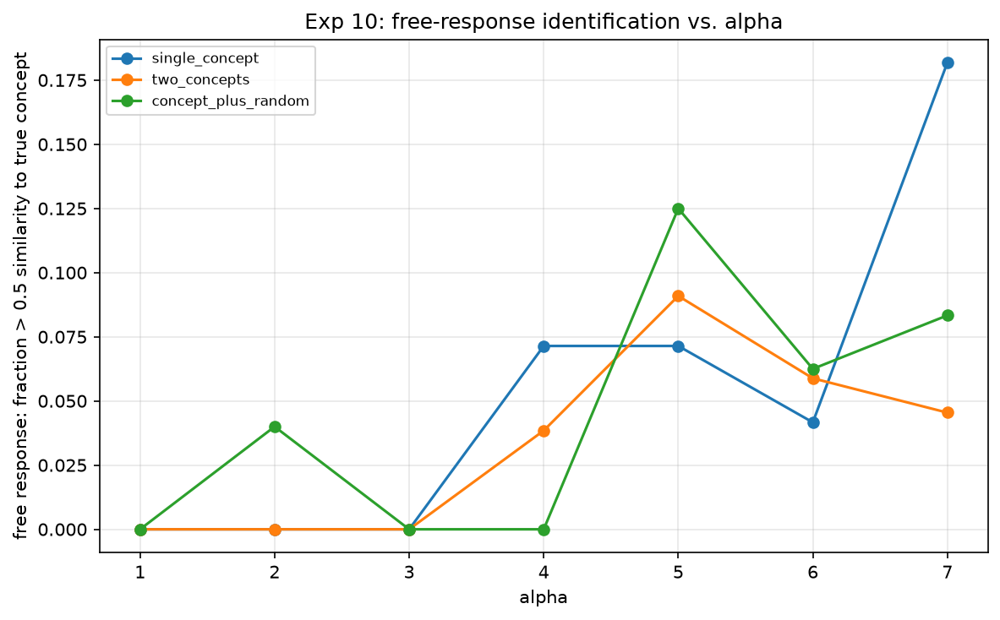

The free-response similarity-above-threshold rate is noisy but trends slightly upward with alpha for `single_concept` and `concept_plus_random`.

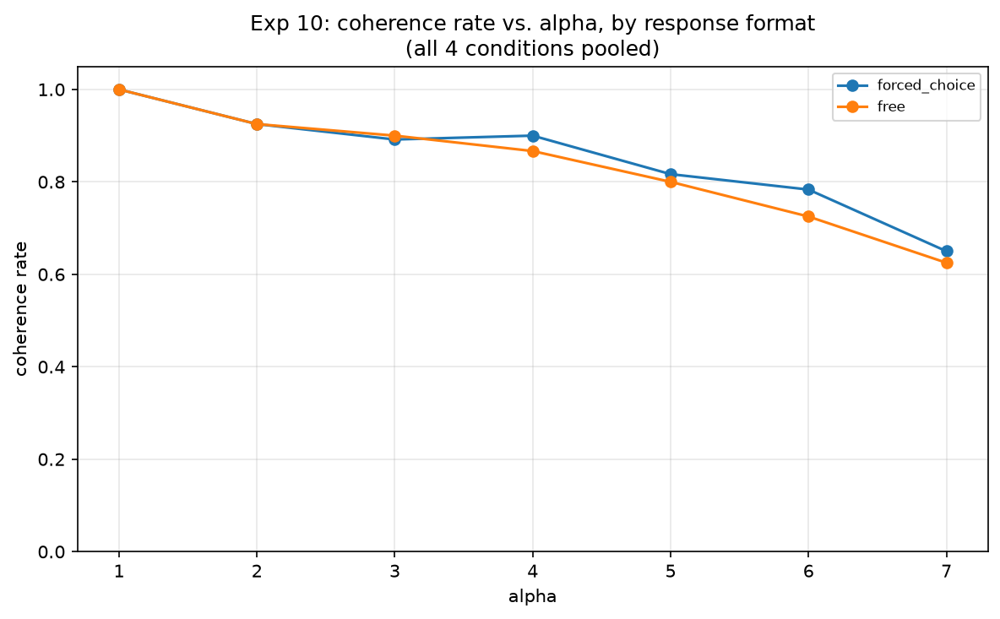

Coherence declines smoothly from 100% (alpha 1) to ~63–65% (alpha 7) in both response formats together.

### A.3 — Experience 11 (layer_ordering, Round 1)

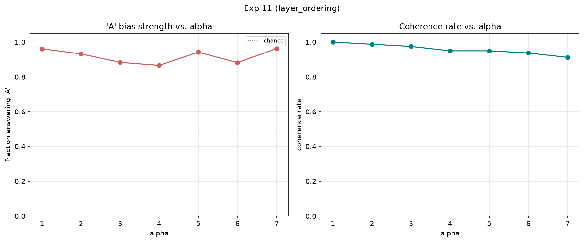

Two things worth separating: the **discrete "always A" bias itself barely moves with alpha** (86–96% picked-A rate at every dose, left panel) — but the logit-contrast-by-alpha figure in the main section showed the *magnitude* of the underlying logit gap clearly rising then fading (peak at alpha 2–3, near zero by alpha 6–7). We now know (Round 2, main section) that this whole shape — bias magnitude aside — reflects the prompt's baseline preference, not an injection effect; it's shown here for the fuller Round 1 picture rather than as remaining evidence of anything.

### A.4 — Modulators (E4/E5/E6, Round 1)

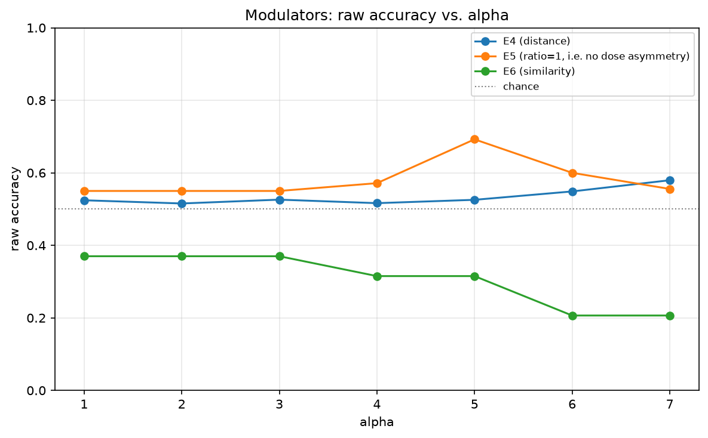

Raw accuracy by alpha, holding E5 to `ratio=1` (no dose asymmetry) for a fair comparison against E4/E6's uniform-alpha design: E4 stays essentially flat just above chance; E5 shows the same rise-then-fall shape seen in `layer_ordering`; E6 declines steadily, entangled with its correct-letter sample imbalance (see main section).

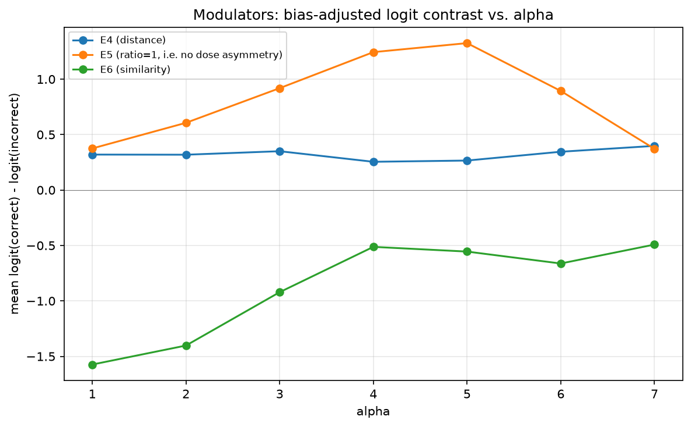

**E4 is flat and consistently positive** (~+0.25 to +0.40) across the whole range — this is the shape behind E4's significant result, still unconfirmed by a sham test (see main section). **E5 (ratio=1) rises then falls**, peaking around alpha 4–5, the same shape as `layer_ordering`'s own alpha curve — which Round 2 showed was baseline, not signal. **E6 stays negative throughout but trends toward zero** as alpha increases, most likely the same "logit gaps compress at high alpha" pattern as E4/`layer_ordering`, not a similarity-specific effect.

---

## Appendix B — Bias-Controlled Re-run Details

### B.1 Reproducibility

- **Round 2 data:** `results/multisteering/experiment_9_counting/raw/multi_detection_trials_{individual,budget}.pt` (alphas/z_totals 2–5, 40 trials/cell, count-only), `results/multisteering/experiment_11_ordering/raw/layer_ordering_trials.pt` (alphas 2–5, 60 trials, paired sham). **Round 1 data preserved** under the corresponding `raw/archive_alpha1-7/` directories for comparison — the appendix A figures above are generated from those archived files, not overwritten by Round 2.
- **Figures:** `docs/misc/reports/generate_figures.py` (Round 1, 18 figures) and `docs/misc/reports/generate_bias_control_figures.py` (Round 2's two figures); both write to `results/multisteering/figures/`.
- **Analysis:** `code/analysis/count_confusion_matrix.py --input <file>` prints the full digit-logit breakdown by dose/condition; `code/analysis/ordering_accuracy.py --input results/multisteering/experiment_11_ordering/raw/layer_ordering_trials.pt` prints the full injected/sham/double-adjusted breakdown by alpha and layer distance.

### B.2 Full per-dose numbers (counting, individual regime, condition=real)

| alpha | mean logit contrast | n |
|---|---|---|
| 2 | −1.80 | 160 |
| 3 | −1.85 | 160 |
| 4 | −1.83 | 160 |
| 5 | −2.26 | 160 |

(`condition=random` tracks within ~0.2 of these values at every dose.)

### B.3 Full per-alpha numbers (ordering, Round 2)

| alpha | injected | sham | double-adjusted |
|---|---|---|---|
| 2 | +0.266 | +0.258 | +0.007 |
| 3 | +0.321 | +0.256 | +0.063 |
| 4 | +0.349 | +0.259 | +0.090 |
| 5 | +0.154 | +0.259 | −0.104 |

The sham line is essentially flat across dose (as expected — no injection means dose shouldn't matter), while double-adjusted stays within noise of zero at every point, even dipping slightly negative at alpha 5.

### B.4 Known limitations / what Round 2 doesn't cover

- **E4/E5/E6 have not been re-tested with the paired-sham control** — see the Modulators section and Recommendation #1 above.
- **Identification has no bias-adjusted logit measure yet.** Its forced-choice format (2 slots × 11 candidates) doesn't reduce to a clean binary contrast the way counting and ordering do; a per-slot `logit(correct label) − logit(most-preferred label)` version is possible but not yet implemented.
- **The narrowed alpha 2–5 range was chosen based on Round 1's observation that the (since-debunked) ordering signal peaked there.** That's no longer a principled reason to search there for a *different* experiment — see Recommendation #5.
